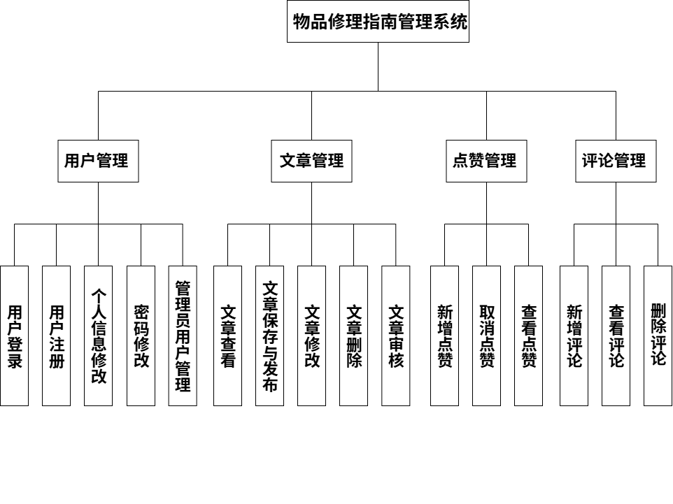

# 基于javaweb的物品修复系统的设计与实现

系统分为前端面向用户的物品修复系统和面向管理的管理系统。

（1）	用户管理
1)	用户登录：用户与管理员可通过账号密码登录系统，根据角色权限进入对应操作界面。 
2)	用户注册：新用户填写基本信息完成注册流程，注册后需登录方可使用系统功能。 
3)	个人信息修改：用户可修改自身昵称、性别等个人信息。 
4)	密码修改：用户与管理员可修改当前账号密码，操作前需验证原密码。 
5)	管理员用户管理：管理员可查看系统所有用户列表及详情，支持新增用户（分配初始角色）、修改用户信息。 
（2）	文章管理
1)	文章查看：用户与管理员可查看系统内已发布的文章。 
2)	文章保存与发布：用户可创建文章草稿并保存（仅本人可见），完成后提交发布至管理员审核。 
3)	文章修改：用户可编辑自身草稿文章；审核失败的文章，用户可基于原内容修改后重新提交审核。 
4)	文章删除：用户可删除自身草稿文章；管理员可删除系统内所有已发布文章（不含用户草稿）。
5)	文章审核：管理员接收用户提交的发布申请，可执行 “审核通过” 或 “审核失败” 操作，审核结果实时反馈给用户。
（3）	点赞管理
1)	新增点赞：用户可对审核通过的文章进行点赞操作。
2)	取消点赞：用户可对已点赞的审核通过文章取消点赞。
3)	查看点赞：用户可查看本人点赞过的所有文章。
（4）	评论管理
1)	新增评论：用户可对审核通过的文章发布评论。
2)	查看评论：用户可查看本人发布的所有文章评论。
3)	删除评论：管理员可删除审核通过文章下的任意评论。

系统功能结构图

搭建环境：

前端：HTML、CSS、JavaScript、Layui框架

后端：Java、MySql数据库、Tomcat服务器

架构：B/S架构，MVC开发模式

开发工具：Eclipse

使用的工具：dbutils,fastjson,commons,lombok,servlet
